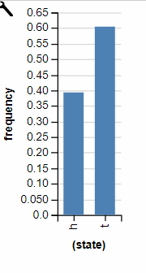

# Generative Models - Exercises

## 1
### a


First one:

```flip() ? flip(.7) : flip(.1)```
$$p(H) = 0.5 \times 0.7 + 0.5 \times 0.1 = 0.4$$

Second:

```flip(flip() ? .7 : .1)```
$$P(H) = \text{return value of \texttt{flip() ? .7 : .1}} $$ 
$$P(H) = (0.5 \times 0.7) + (0.5 \times 0.1) = 0.4$$

Third:

```flip(.4)```

Trivially, $P(H) = 0.4$

### b

Visualization Code:
```js
viz(repeat(1000, function() {flip() ? flip(.7) : flip(.1)}))

viz(repeat(1000, function() { flip(flip() ? .7 : .1) }))

viz(repeat(1000, function() {flip(.4)}))
```

## 2
### a
The first program samples the `foo` variable once, and then copies it three times in a list. The second program independently samples three times and places these three independent samples in the list.

### b
```js
var foo = mem(function() { return flip() })
display([foo(), foo(), foo()])
```

### c

```js
var foo = mem(function() { return flip() })
display([foo(), foo(), flip()])
```

## 3

### a

Program A:
$P(A)$ is shorthand for $P(A=H)$

$$P(C) = 0.5 \times (P(A) \land P(B)) + 0.5 \times (P(A) \lor P(B))$$
$$= 0.5(0.45) + 0.5(0.025)$$
$$ = 0.225 + 0.125 = 0.35$$

Program B:
$$P(C) = 0.9\times P(B)$$
$$P(B) = 0.9 \times P(A)$$
$$P(A) = 0.9$$
$$\therefore P(C) = 0.9^3 = 0.729$$

It seems like it is more likely that program B outputted that probability distribution.

### b
Yes, it is possible that program A outputeed that distribution, although it is very unlikely that this is the case.

## 4

### a

>Under this model, what is the probability that the patient is sneezing? 
$$P(\text{sneeze}) = P(\text{cold} + P(\text{allergies}) - P(\text{cold}, \text{allergies}) \\
= 0.3 + 0.2 - 0.06 = 0.44 $$

> What is the probability that the patient is sneezing and has a fever?
$$ P(\text{sneeze}, \text{fever}) = P(\text{cold}) = 0.2 $$


### b

```js
Infer({method: "forward", samples: 1000}, function() {
  var allergies = flip(0.3)
  var cold = flip(0.2)
  var sneeze = cold || allergies
  var fever = cold
  return sneeze && fever
})
```


### c

```js
var allergies = function(person) { return flip(.3) }
var cold = function(person) { return flip(.2) }

var sneeze = function(person) { return cold(person) || allergies(person) }
var fever = function(person) {return cold(person)}

Infer({method: "forward", samples: 1000}, function() {
  var a = allergies("bob")
  var c = cold("bob")
  var s = sneeze("bob")
  var f = fever("bob")
  return f && s
});
```

This is different to the distribution we expected. This is because "bob" is not a consitent entity in the code, and so the underlying symptoms that bob has arn't either. We need to memoize whether or not he has allergies or the cold so that the down-stream probabilities are consistent.

## 5

### a 
There is a 50% chance that the fair coin is heads. If it comes out to heads, it will have a 70% to stay heads. However, if it is tails, it has a 10% change to become heads.

This means, the chance that the bent coin comes out as heads is either that the fair coin was heads, and then it stayed heads $0.5 \times 0.7$ or it was tails and switched to heads $0.5 \times 0.1$

Therefore:

$$P(\text{bentCoin} = H) = 0.5 \times (0.7 + 0.1) = 0.56$$

### b
```js
var makeCoin = function(weight) {
  return function() {
    return flip(weight) ? 'h' : 't'
  }
}
var bend = function(coin) {
  return function() {
    return coin() == 'h' ? makeCoin(.7)() : makeCoin(.1)()
}
}

var fairCoin = makeCoin(.5)
var bentCoin = bend(fairCoin)

Infer({method: "forward", samples: 1000}, function() {
  return bentCoin()
})
```

Seems about right



## 6

### a

For this distribtuion to be 5, it needs to roll tails 5 times in a row, and then heads on the 6th roll. The probability of this, which turns out to be the same for any series of heads or tails that is 6 long is $0.5 ^ 6 = 0.015625$

### b

```js

var geometric = function() {
  return flip() ? 0 : 1 + geometric()
}

Infer({method: "forward", samples:1000}, function(){
  return geometric() == 5
})
```

Looks about right:


## 7

### a

```js
var a = flip(0.8)
var b = (a && flip(0.5)) || (!a && (flip(0.06/0.2))) 
display([a, b])
```

### b

```js

Infer({method: "forward", samples:1000}, function(){
  var a = flip(0.8)
  var b = (a && flip(0.5)) || (!a && flip(0.06/0.2)) 
  return {A: a, b: b}
})
```


## 8

### a

The closer to P = 0.5, you get the two distributions to be closer together. At either end, it collapses to having heads way more often or tails way more often. This is because when heads are more likely in the original coin, it is likely that you will get two heads in a row (if they have to be the same), and the same for tails at the other end of the probability spectrum.

### b

The probability distrbution of heads and tails on the flip sequence will be the same as the original fair coin. This is because when you have an equal probability between coins, any flip sequence is equally likely, and so the HH sequence is the same likelyhood as the TT sequence.

## 9

```js
var ground = {
  shape: 'rect',
  static: true,
  dims: [worldWidth, 10],
  x: worldWidth/2,
  y: worldHeight
}

var rect = {
  shape: 'rect',
  static: false,
  dims: [10, 100],
  x: worldWidth/2,
  y: 390
}

var object = {
  shape: 'circle',
  static: false,
  dims: [25, 25],
  x: 0,
  y: 390,
  velocity: [100, 0]
}

var bowlingWorld = [ground, rect, object]
physics.animate(1000, bowlingWorld)
```

## 10

```js


// Returns height of tower
var getTowerHeight = function(world) {
  return worldHeight - highestY(world)
}

var doesTowerFall = function (initialW, finalW) {
  var approxEqual = function (a, b) { Math.abs(a - b) < 1.0 }
  return 1 - approxEqual(highestY(initialW), highestY(finalW))
}

var towerFallDegree = function(initialW, finalW) {
  var max = function (a, b) {a > b ? a : b}
  var min = function (a, b) {a < b? a: b}
  return max(0, min(1, (highestY(finalW) - highestY(initialW))/highestY(initialW))); 
}

var visualizeInstabilityMeasure = function(measureFunction) {
  var initialWorld = noisify(almostUnstableWorld)
  var finalWorld = physics.run(1000, initialWorld)
  var measureValue = measureFunction(initialWorld, finalWorld)
  print("Instability measure: " + measureValue)
  print("Initial height: " + getTowerHeight(initialWorld))
  print("Final height: " + getTowerHeight(finalWorld))
  physics.animate(1000, initialWorld)
}

// Test binary doesTowerFall measure
// visualizeInstabilityMeasure(doesTowerFall)

// Test custom towerFallDegree measure
visualizeInstabilityMeasure(towerFallDegree)
```

My continuous measure represents the percentage of the original height that was lost by falling. This is a good continuous measure of instability as it is bounded between 0 and 1 and also is proportional to our notion of stability: the more the tower shrinks when falled, the less stable it was.

### b

A tower that falls completely over, yet stays in a relatively high pile. This will have a value of instability in the 0.5s, but the tower did fall, and any human would say that it did indeed fall. I think that in this case the discrete case is better at capturing the human sense of "falling"